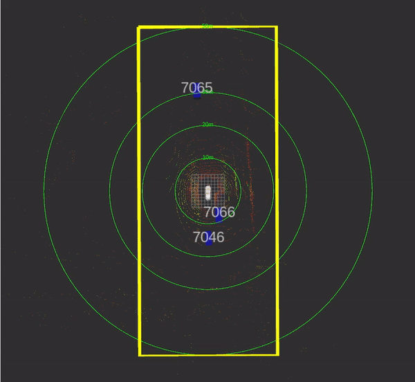
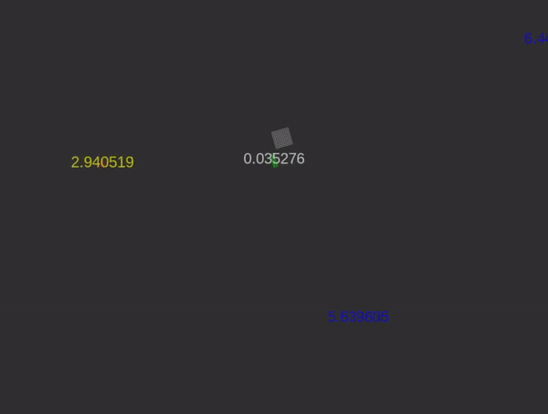

# skyautonet bevfusion post-processing
2023 Summer Internship Program at **SkyAutoNet**

This is a post-processing repository of BEVfusion project.
> https://github.com/mit-han-lab/bevfusion

## Tracking


### Prerequisites
- OpenCV >= 4.2.0
- ROS2(Foxy)

### Algorithm
Use SORT(Simple Online Realtime Tracking) Algorithm with Bird-Eye View bounding boxes.

- Kalman Filter
- Hungraian Algorithm

### Usage
```linux
ros2 launch tracking_algorithm tracking_launch.py
```

### Citation
> https://github.com/abewley/sort **abewley/sort**
> 
> https://github.com/mcximing/sort-cpp **mcximing/sort-cpp**
>
> https://github.com/Hyun-je/SORT-ros **Hyun-je/SORT-ros**

---

## TCP Socket

### Prerequisites
- Server
  - ROS2(Foxy)
- Client

### Algorithm
TCP socket programming with ROS2.


### Usage
**Server**
```linux
ros2 run tcp_socket tcp_socket
```

Client
```linux
g++ -o client client.cpp
./client [YOUR] [HOST] [PC] [IP]
```

---
## Risk Assessment


### Prerequisites
- Carla 0.9.12
- ROS2(Foxy)

### Algorithm
Calculate TTC(Time To Collision) in Carla simulator.

### Usage
```linux
ros2 run risk_assessment risk_assessment
```


